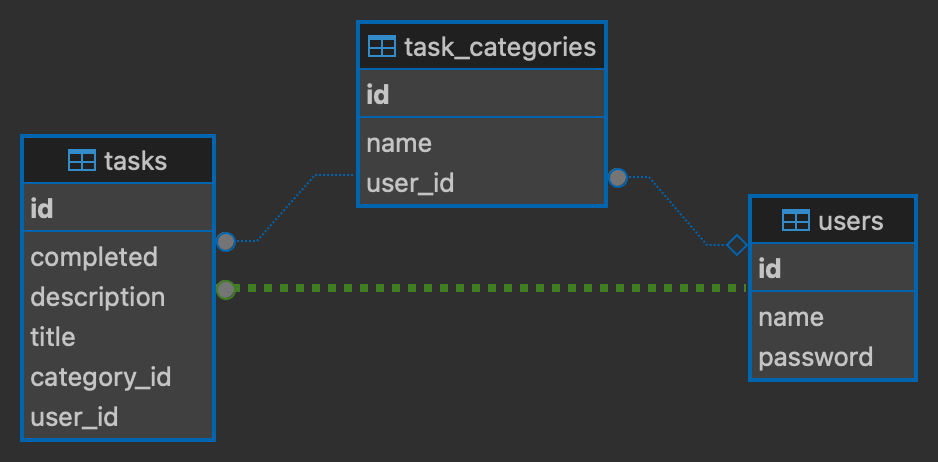

# Todo App  Angular, Spring Boot, AWS, CI/CD

## Table of Contents
1. [Introduction](#introduction)
2. [Architecture Overview](#architecture-overview)
3. [Frontend: Angular](#frontend-angular)
4. [Backend: Spring Boot](#backend-spring-boot)
5. [Database](#database)
6. [AWS Deployment](#aws-deployment)
7. [CI/CD Pipeline](#cicd-pipeline)
8. [Security Considerations](#security-considerations)

## 1. Introduction
This provides a comprehensive overview of our Todo application, which is built using Angular for the frontend, Spring Boot for the backend, and deployed on AWS using CI/CD practices. 

URL : https://todoapp.online/

## 2. Architecture Overview

Our Todo app follows a microservices architecture:
- Frontend: Angular 
- Backend: Spring Boot
- Database: PostgreSQL
- Deployment: AWS (EC2, S3, RDS)
- CI/CD: GitHub Actions

## 3. Frontend: Angular
- Components:
  -homemarketsite
  -login
  -createaccount
  -todohome (Parent component for category and task list)
  -category
  -task

- Services:
  - category,task (for API)
  - category-color (for dynamic colors in categories)
  - auth (for authentication APIs)
  - error-code(error code and message provider)
  - authInterceptor (for appending token in apis)
  - Authguard for authentication handlings

## 4. Backend: Spring Boot
- Spring Boot version:
  - Controllers (UserController,TaskController,TaskCategoryController)
  - Hibernate (Pojo to query)
  - pom.xml

- API endpoints: 
  - POST /user/register
  - POST /user/login
  - GET /api/categories
  - POST /api/categories
  - PUT /api/categories/{id}
  - DELETE /api/categories/{id}
  - GET /api/tasks
  - POST /api/tasks
  - PUT /api/tasks/{id}
  - DELETE /api/tasks/{id}

  

## 5. Database
- Type: [POSTGRESQL]
- 

## 6. AWS Deployment
- Services used:
  - EC2 for backend hosting (virtual maching)
  - S3 for static frontend hosting
  - RDS for database
  - Route 53 for DNS management
  - CloudFront for content delivery

## 7. CI/CD Pipeline (Git Actions
- Stages:
  1. Build
  2. Deploy 

## 8. Security Considerations
- Authentication:JWT Tokem
- HTTPS 
- CORS configuration

